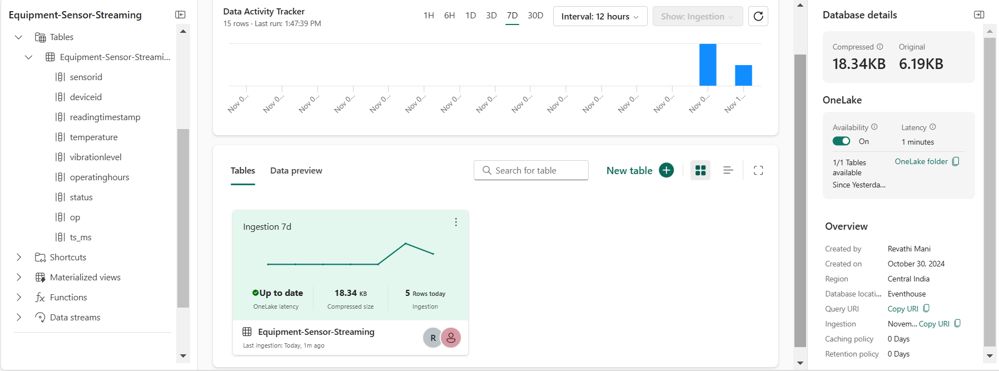

[Back to Readme](\README.md)

**Event House Configuration**

- Once the event stream configuration is setup and streaming correctly, the KQL table will automatically get created in event house. 
- One lake availability is disabled by default. Enable to let the downstream processes consume the streaming data.

    
