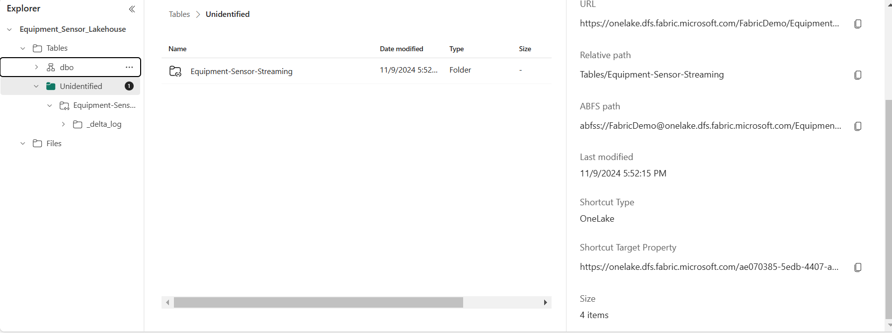

[Back to Readme](README.md)

**Lake House Configuration**

Enabling the one lake availability will let the users to create shortcut in lakehouse. Having the shortcut created to one lake will enable the downstream to model the data in data warehouse/lakehouse.

