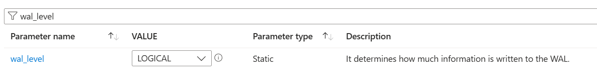
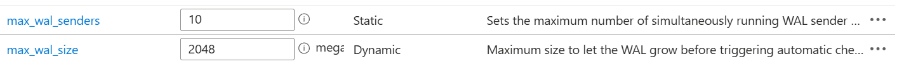
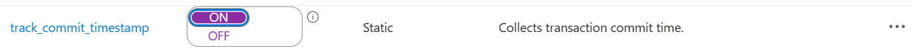

**Source Configuration**

- Create an Azure DB for postgresql
- Set the server parameters as below to enable CDC
     - wal_level to logical

        
     - max_replication_slot to a higher number 

         
    - maximum write ahead log senders and size to a greater value

        
    - set track commit timestamp to On

        
- Create publication and replication slot for the tables in the server

    SELECT * FROM pg_create_logical_replication_slot('my_replication_slot', 'pgoutput');

        
- Grant the user role with replication permission

    ALTER ROLE <user_name> WITH REPLICATION;

        
- To setup sample dataset,
    - run the  EquipmentSensorsDataGenerator.py
    - run the insert_transaction_data.py   
